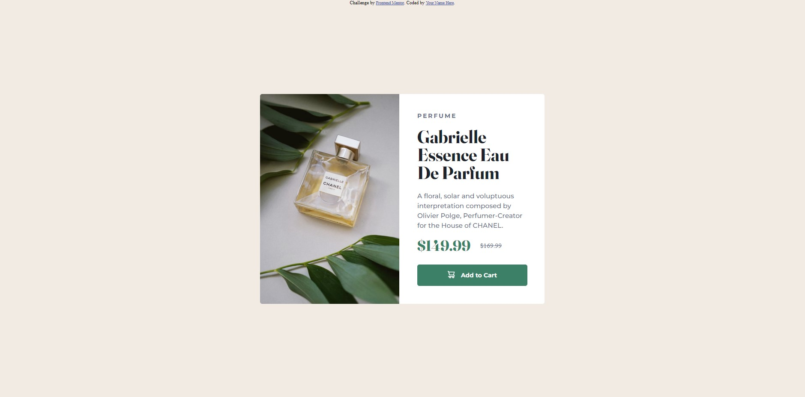
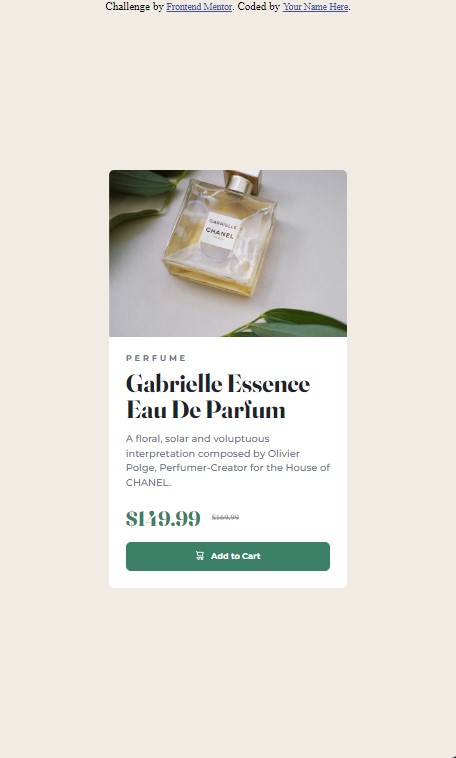

# Frontend Mentor - Product preview card component solution

This is a solution to the [Product preview card component challenge on Frontend Mentor](https://www.frontendmentor.io/challenges/product-preview-card-component-GO7UmttRfa). Frontend Mentor challenges help you improve your coding skills by building realistic projects.

## Table of contents

- [Overview](#overview)
  - [The challenge](#the-challenge)
  - [Screenshot](#screenshot)
  - [Links](#links)
- [Author](#author)

## Overview

This is a challenge from Frontend Mentor to build a product card which responsive in both desktop and mobile view. I'm using pure HTML and CSS to solve this challenge.

### The challenge

Users should be able to:

- View the optimal layout depending on their device's screen size
- See hover and focus states for interactive elements

### Screenshot

### Links

- Solution URL: [Add solution URL here](https://your-solution-url.com)
- Live Site URL: [https://joshuakme.github.io/fm-product-preview-card-component/](https://joshuakme.github.io/fm-product-preview-card-component/)

## My process

I took around 1 hour to get this completed. Although it is not hard, but there are alot of details need to cover for the good looking card.

### Built with

- Semantic HTML5 markup
- CSS custom properties
- Flexbox

## Author

- Website - [Joshua Koh](https://github.com/Joshuakme)
- Frontend Mentor - [@Joshuakme](https://www.frontendmentor.io/profile/Joshuakme)
